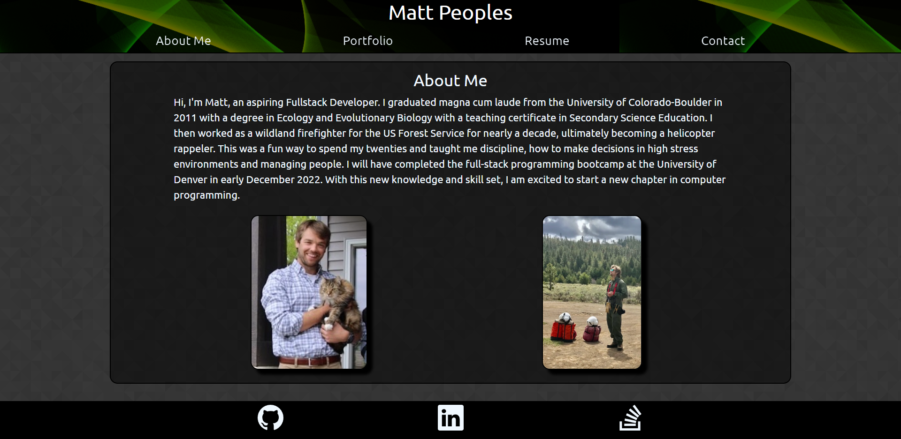

# My React Portfolio 

My updated portfolio built with react.

## Table of Contents

- [Skills Practiced](#skills-practiced)
- [Installation](#installation)
- [Usage](#usage)
- [Screenshot](#screeenshot)
- [Deployed App](#link-to-deployed-app)
- [Questions](#questions)

## Skills Practiced

- Using the React.js framework to build a modern one-page responsive site.
- Uploading a site to Github Pages
- Using state
- Using utils for validation
- Clean design
- Importing images correctly
- Debugging Code

## Installation

If you want to download the app locally follow these steps.

1. Fork the repository
2. Clone the repo locally
3. In the terminal run "npm i" to download the dependencies.
4. Run "npm start" to initiate the app.

## Usage

View my portfolio and contact me via email.

## Screeenshot

## Link to Deployed App

[Deployed App](https://peoplesm.github.io/)

## Questions

If you have any questions about this projects, please contact me directly at mep.summit@gmail.com. You can view more of my projects at https://github.com/peoplesm.
